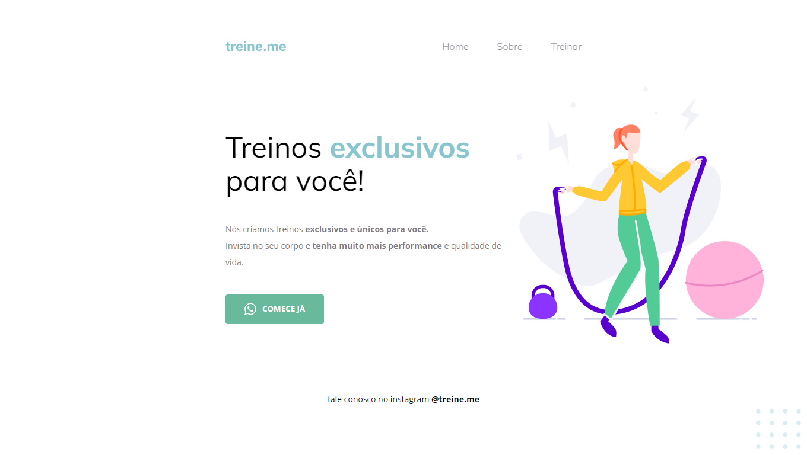

<h1 align="center"> Iniciante - Corrigindo bugs (02) 👀</h1>

Resolvendo bug iniciante do modulo explorer 
<a href="https://spgunk.eu.org">Meu portifolio em NextJS</a>

Antes

Depois

  <a href="#-tecnologias">Tecnologias</a>&nbsp;&nbsp;&nbsp;|&nbsp;&nbsp;&nbsp;
  <a href="#-projeto">Projeto</a>&nbsp;&nbsp;&nbsp;|&nbsp;&nbsp;&nbsp;
  <a href="#-layout">Layout</a>&nbsp;&nbsp;&nbsp;|&nbsp;&nbsp;&nbsp;
  <a href="#memo-licença">Licença</a>

  

 

## 💻 Sobre o desafio

No desafio tem um codigo totalmente diferente das aulas feitas da explorer e devemos corrigilo da mesma forma que aprendemos nas aulas feitas (sem olhar as respostas). como mostra as imagens acima.

## 🚀 Tecnologias

Esse projeto foi desenvolvido com as seguintes tecnologias:

- Figma
- HTML e CSS
- Git e Github

## 💻 Projeto

Esse projeto foi um desafio feito pela RocketSeat como "desafio iniciante 2"
e você pode ver como estava o projeto na imagem acima..

- [Veja outros Principais projetos meus.](https://painelunknowbr.eu.org)

## 🔖 Layout

Você pode visualizar o layout do projeto através [DESSE LINK](https://www.figma.com/file/yMjC2bz09GPyDyQzzsk1Lq/Explorer---Projeto-02-(Copy)?type=design&node-id=1-5&mode=design&t=YRyQAlgAJdU6gC55-0). É necessário ter conta no [Figma](https://figma.com) para acessá-lo.

## :memo: Licença

Esse projeto está sob a licença MIT.

---

Feito com ♥ by Hex034 :wave: [Veja outros projetos meus](https://spgunk.eu.org)